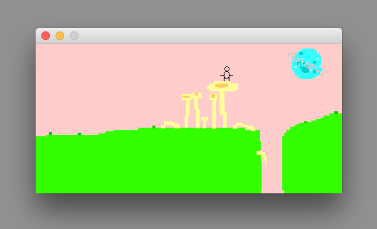

# Littleman's World Builder #

#### Note: ####
This is a very old project. It has not been updated since I first worked on it, which was at a time when I had much less experience as a programmer than I do now. For a much better implementation of a technically similar but aesthetically very different project, see the spiritual successor to this project, Bouncing Ball. I have kept this project up because I put a lot of work into it and I still think the finished product is neat, despite the many flaws in its design and implementation.

## Purpose ##

This is a minimalist game engine for creating two dimensional maps that an ASCII stick figure, controlled using arrow keys, can walk around in.

The original idea behind this project was to allow a user to draw maps with complex collision and other properties, which would be instantly playable (no hard-coding of individual maps or features, all relevant information stored in map files, etc.) within a simple game.

The result of this endeavor was a simple "platformer" style game engine made completely from scratch that has automatic collision detection based on maps drawn in a Microsoft-Paint-style map editor. The map editor allows the user to draw and edit rectangles and ovals with various types of collision and other traversal characteristics, which can then be explored by the little ASCII-based character sprite.

The player has a two frame walking animation, which is made with the ASCII characters `O o H -` and `O o X ~` respectively.

## Features ##

The game engine and map maker support the following features:
* Adjustable map size

* Adjustable player starting point
* Draw rectangles with the following options:
	* Collision type
		* Collision: collides with player
		* No collision: does not collide with player
	* "Climbability" (i.e. can a shape be climbed?)
		* Ladder climb: player can climb one step at a time, like climbing a ladder or a rock wall

		
		* Jump climb: player can climb more quickly by jumping instead of taking single steps upwards

		
		* Watery: player can climb, but will slowly sink back down, like swimming in water

		

* In addition to drawing rectangles, the user can also draw ovals
* Adjustable 24-bit shape colors (the map maker has a fully functioning color chooser, which you can access by clicking on the color preview in the tool box)

* Layering: all shapes can be placed in front of or behind the sprite, and shapes can be placed in front of or behind each other. Here is an example of a map with one oval drawn in front of the player (left), and one oval drawn behind the player (right):

	

* Two types of "warps" (teleportation mechanisms that can be placed in maps)
	* Edge warps: walking off the edge of a map will place you on the opposite side of another (or the same) map, as if you had walked from one map to another and the maps were scrolling. Edge warps can be optionally added to the top, bottom, left, and/or right edges of a map. An example of edge warps (this map has edge warps on the top and bottom edges, and none on the left and right edges):

	

	* In-map warps: non-visible rectangles that cause the player to be automatically teleported to another position on another (or the same) map when the player walks into them. These are useful for doors, portals, etc. An example of in-map warps in action:

	
* Many useful features implemented in the map maker, including: easily draw and edit maps with all of the aforementioned features, draw player sprite previews for comparing player size to map scale, edit all properties of existing shapes, modify shape layering/ordering, an undo button for shape drawing mode, and more.

##### Debugging and settings: #####
* Turn off incrementing acceleration due to gravity by setting the value of `boolean USE_GRAVITY_ACCELERATION` to false in the `GameState.java` class. There are also some other settings affecting acceleration due to gravity that you will find adjacent to this field.
* Display the player's hit box by changing the value of `boolean SHOW_HIT_BOX` to true in the `GameWindow.java` class. The hit box is a red square that indicates the collision and climbing area of the player. This is useful for debugging collision and climbing issues. See the variable's comments in the code for more specific details. The hit box looks like this:

	
	

## Getting Started ##
The map maker can be launched by running the MapMaker class, and the actual game can be launched by running the GameState class. To change the starting map file, edit the field variable `int map` in the GameState.java class to have the value of the desired map number.

## Map Maker File Format ##

Map file names should be a map number with a `.txt` file extension, e.g. `15.txt` for map number 15.

Map files are saved as plaintext. The format of a map file is as follows (replace each variable name with its corresponding value):

	mapWidthInPixels mapHeightInPixels
	playerSpawnPointXPosition playerSpawnPointYPosition
	mapNumberOfLeftEdgeWarp mapNumberOfRightEdgeWarp mapNumberOfTopEdgeWarp mapNumberOfBottomEdgeWarp //the value 'n' means none, in which case player just warps to the opposite side of the current map
	numberOfShapesToReadFromTheFile
	topLeftCornerXPosition topLeftCornerYPosition width height collisionType climbabilityType colorRedValue colorGreenValue colorBlueValue //each of these lines represents one shape. this same format is repeated for each shape on the map
	numberOfInMapWarpsToReadFromTheFile
	warpToMapNumber warpToXCoordinate warpToYCoordinate //each of these lines represents one in-map warp, this same format is repeated for each warp on the map

	//collision type can be: 0 (no collision, draw behind player), 1 (collision on), 2 (no collision, draw in front of player), 3 (no collision oval, draw behind player), 4 (no collision oval, draw in front of player), or 5 (warp. is not drawn, but will teleport the player).
	//climbability type can be: 0 (can't climb), 1 (can ladder climb: no gravity applies, and can climb one step at a time), 2 (watery: can climb, but slower gravity applies), or 3 (can jump climb: no gravity applies, and can climb quickly by jumping). anything greater than or equal to 10 is to keep track of which warp is assigned to which warp rectangle (e.g. 10 = warp 0, 11 = warp 1, etc.).

## Additional Images ##

Using edit mode in the map maker to modify existing shapes:

Gameplay on a simple map:

The window that the game runs in:

## Built-In Maps List ##

	0: blue-green test map
	1: ocean
	3: abstract test map (connects to: 2)
	4: city
	5: edge warps test (connects to: 6, 7, 8, 9)
	19: space (connects to: 10, 11, 12, 13, 14, 15, 16)
	17: pipes
	18: ovals and block layering test
	20: grass (connects to: 21, 22, 23)
	32: ladder climb test
	33: jump climb test
	34: water climb test
	36: clouds (connects to: 37, 38)
	39: ladder
	51: fall test
	60: climb test

## Areas For Improvement ##

I'm not working on this project anymore, but some areas that could use improvement (not a comprehensive list):
* Read the value of the starting map for the game from a configuration text file, as well as some other things, such as fall acceleration settings, player hit box display settings, etc.
* Add a more traditional file dialog to the map maker
* Improve map naming system so that text file names are supported, rather than just integers
* Improve acceleration due to gravity
* Improve map maker edit mode to support clicking and dragging shapes and shape vertices to edit them, rather than typing in new coordinates for each vertex
* Add support for triangles / irregular polygons, rather than just rectangles and ovals
* Improve map maker file format to be more elegant
* Simpler user interface for the map maker, and more thorough documentation / help pages for all of its features
* In general, the code would greatly benefit from being reorganized and refactored.

As mentioned earlier, the mistakes made on this project informed the  Bouncing Ball project.
